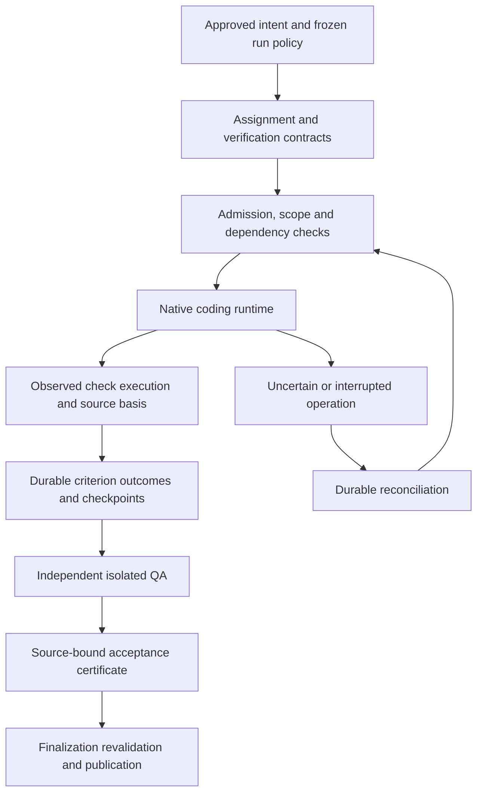

# Rafi harness implementation design brief

> Handoff copy packaged 2026-10-10. Place this folder at the Rafi repository root. Source/test links resolve against that repository; historical observations describe the inspected reference snapshot. Read [agent implementation instructions](AGENT-INSTRUCTIONS.md) before execution.

Date: 2026-10-09. Status: proposed design boundaries for implementation planning; no production contract, source change, integration, or rollout is approved here.

Read with the [requirements](rafi-harness-requirements.md), [24-risk codebase review](rafi-harness-regression-review.md), and [implementation plan](rafi-harness-implementation-plan.md). Requirements remain the acceptance authority. This brief resolves planning ambiguities and identifies decisions an implementer must settle before changing affected contracts.

## 1. Objective and architecture boundary

Build a thinner, more observable Rafi coordinator that reliably delivers substantial approved work. Preserve the existing intent, scope, queue, ownership, independent QA, finalization, and conservative recovery contracts. First verify current repairs; then add missing execution evidence and measurable quality improvements. Evaluate larger assignments and external practices after establishing trustworthy measurements.

Rafi owns authorization and durable acceptance. A native runtime owns the supported coding tools and its local reasoning loop. Ownership of compaction, tool cancellation, response correction, and recovery must be explicit per adapter. Neither layer may automatically replay an operation whose outcome is uncertain.

Proposed flow:

The diagram proposes stronger verification inside existing authority boundaries. It does not imply that observing tests grants mutation permission or that test results replace QA.

## 2. Responsibilities to freeze before integration

| Responsibility | Proposed owner | Required boundary |
| --- | --- | --- |
| Approved plan, ticket IDs, dependency eligibility | Rafi | Imported plans remain proposals until approved; no second authoritative backlog |
| Invocation execution scope and public step semantics | Rafi | Saved context cannot widen explicitly selected work |
| Mutation admission and durable writer fencing | Rafi | Existing project writer lease remains the baseline |
| Coding tools and local implementation loop | Native runtime | Actual capabilities, permissions, cancellation, and event coverage declared |
| Native context management | Runtime, coordinated by Rafi | One owner per operation; native ceilings and host thresholds reported separately |
| Provider terminal outcome | Adapter/runtime | A resolved promise or formatted result does not imply successful execution |
| Response-envelope repair | Rafi through declared runtime capability | Bounded, response-only, observed, source-preserving, no implementation replay |
| Check execution | Authorized execution boundary | Host-observed results distinguish actual execution from provider claims |
| Acceptance and waivers | Independent Rafi QA and existing authorized waiver path | Builder cannot self-accept; budget overrides and disputes are not waivers |
| Restart and uncertain-dispatch reconciliation | One declared coordinator | Reservations, original operation identity, evidence and uncertainty survive restart |
| Commit, merge, push and publication | Existing delivery contract and user authorization | A foreign harness cannot introduce automatic publication |
| Evidence retention and status projections | Rafi | Projections do not acquire authority; optional telemetry pruning cannot delete required proof |

An adapter may lack a capability. A compatibility profile must state the limitation and supported fallback; it cannot report full conformance by inferring missing data.

## 3. Proposed verification contracts

The following are conceptual fields, not a committed TypeScript interface or database schema. Implementers should reuse existing spec/runtime identities and introduce the smallest versioned extension needed.

### 3.1 Criterion contract

A criterion identifies: approved plan revision; ticket/assignment; stable criterion ID and revision; behavior and expected outcome; mandatory or optional status; risk class; verification type; command/scenario ID; working directory; prerequisites; permitted execution environment; expected artifacts; independent reviewer responsibility; and applicability of behavioral red-to-green validation.

Discovery uses actual project scripts and relevant nested manifests. Do not infer required checks solely from filename heuristics. A command is executable data only through a validated, authorized runner; untrusted repository instructions cannot widen tool or network authority.

A criterion may require multiple checks. One broad test command may cover several criteria only when coverage is explicitly declared and independently reviewed. Unknown coverage remains unknown. Builder-authored convenience tests remain distinguishable from protected independent acceptance checks.

Freeze the mandatory check set, runner configuration and expected coverage before Builder mutation. Changes to tests, assertion counts, skip filters, command selection or risk/TDD applicability require an inspectable reason and independent review; a Builder cannot reduce its own completion gate. Zero selected tests, all-skipped tests, a success-shaped partial run or disabled negative cases are not passing mandatory verification. Appropriate non-test checks may still be valid when their declared type and independent rubric warrant them.

### 3.2 Execution occurrence

Record a unique execution occurrence separately from its content digest. Bind it to the run, assignment, ticket, operation, role/session/generation, criterion/check revisions, command and cwd, source basis, test definition basis, relevant environment/configuration basis, timestamps/sequence, tool correlation, dispatch certainty, result, exit status when available, observation completeness, and immutable evidence references.

Outcomes distinguish passed, failed, blocked prerequisite, not run, cancelled, and uncertain. Observation completeness is a separate dimension: a success-shaped partial transcript is not complete proof. Keep original late events attached to the original occurrence. Raw integrity and redacted diagnostic views have distinct provenance.

Record output availability explicitly. An exit code can establish command termination; it does not establish every acceptance assertion, appropriate coverage, or semantic validity of a red phase.

### 3.3 Tested source basis

Capture the source actually tested, including relevant staged/unstaged/untracked state and test definitions, using the existing snapshot/path rules where possible. A final turn digest cannot retrospectively bind an earlier check.

Preferred initial design: execute completion-critical checks against an immutable/disposable snapshot through a controlled runner. Supplemental native-tool observations can capture practical in-session TDD if they provide complete lifecycle and basis evidence. Compare implementation complexity before choosing the boundary.

If checks must run on a mutable workspace, detect changes during execution and classify the binding as invalid/uncertain unless the runner can prove a stable tested basis. Never claim that before/after equality rules out an edit that was reverted mid-check. Concurrent/background work, shell chains, truncated output, and missing terminal events require explicit handling.

Conservative full-basis invalidation is the initial safe default. Later impact-based reuse requires declared coverage and F07 evidence; it is a separate optimization.

The existing source state distinguishes `contentDigest`, `originDigest` and the combined `digest` in [qaSnapshot.ts](../packages/ai-foreman/src/qaSnapshot.ts). A clone can contain the same product bytes while having a different repository origin. Bind the original authority/source basis, the explicit snapshot content mapping, and the actual execution environment separately. Do not compare clone and source combined digests as though their origins must match, or replace authority identity with a content hash. Test legitimate relocated snapshots as well as identical content from a foreign run/worktree.

Disposable does not mean immutable. Completion-critical execution must enforce the declared source/dependency boundary or report that the basis cannot be trusted. Test write-through dependency symlinks and source edits reverted before the terminal event. Store receipts in existing control storage where possible: the current product path policy excludes `.rafi` and `.foreman`, not arbitrary new product paths. Evidence publication must not invalidate its own source endlessly, and a new exclusion must never hide an app/test change from finalization.

### 3.4 Criterion disposition and certificate integration

Preserve executed occurrences even when they cease to apply to current source. Derive current criterion disposition from applicable evidence, unresolved findings, prerequisite state, independent QA, and any authorized scoped waiver. A dispute initiates independent reassessment; it does not resolve the criterion by itself.

Extend the existing review basis/certificate contract to bind the verification contract version, applicable execution evidence set, criterion dispositions, and waiver identities. Keep source capture, independent QA identity, immutable receipt checks, and single-use finalization binding. Fresh, recovered, and finalization-only paths must enforce equivalent rules.

A valid `qa_pass` with missing mandatory observed evidence cannot satisfy the stronger contract. All observed checks passing also cannot replace independent QA. QA-off behavior must be specified explicitly: execution verification can still be required without mislabeling it independent review. Existing configured QA-off behavior must not silently gain a breaking contract.

Enforce the same check-evidence contract on the initial pass and a pass returned during report recovery; both currently call `finishV2Pass` in [qaReview.ts](../packages/ai-foreman/src/qaReview.ts). Test the host callers and finalization consumer, not only the reducer or response parser. Preserve retry/remediation allowances and the final independent recheck after the last permitted fix. An execution-proof failure must not redispatch implementation or consume an unrelated correction allowance merely to manufacture a report.

### 3.5 Practical red-to-green classification

Before work, classify a task as applicable test-first repair/feature, already-green validation, or a justified exception such as documentation-only work or an impractical pre-change executable test. Classification and rationale remain inspectable.

For an applicable case, retain: the expected behavior; final test identity; pre-change source; observed failure attributable to the missing/incorrect behavior; changed source; observed passing rerun; and related regression checks. Preserve ordering through interruptions, handoffs, and restarts.

Infrastructure failure, unrelated compilation failure, a deliberately false assertion, deleted assertions, and fabricated output are not behavioral red. If the test changes, explain why and demonstrate that the final test detects the original defect on disposable pre-fix source where practical. Do not reset the user's checkout to reconstruct evidence.

A host can observe ordered executions, bindings, and output. Semantic attribution of the failure still needs a behavioral rubric and independent judgment; do not describe this as a mathematical proof of TDD. Unsupported observation remains unavailable. Exceptions need suitable post-change independent checks and do not count as demonstrated red-to-green success.

### 3.6 Verified checkpoint and progress

A checkpoint references accepted criteria, applicable source/evidence, outstanding criteria/findings, pending decisions, uncertain operations, next eligible work, and remaining budgets. It is a durable record, with human-readable progress files as projections.

A green checkpoint states its checked scope. It neither completes the whole app nor authorizes source rollback. Later edits may invalidate evidence; preserve the historical checkpoint and display which current criteria need rechecking. Meaningful progress includes validated behavior, resolved decisions, and safe reconciliation, not token volume or arbitrary file churn.

## 4. Storage, observer, and recovery design constraints

Use one owning adapter event pump with safe observation fan-out. The validation observer must not create a competing event iterator. Keep authoritative observation/drain semantics; bound optional subscribers without blocking terminal processing. Observer failure cannot silently drop completion-critical evidence. Test replaced adapters, floods, slow/throwing observers, cleanup and interleaved sessions.

Persist immutable evidence before authoritative references. Reserve dispatch intent and budget atomically with existing revision and admission fences; do not hold SQLite transactions across provider waits or artifact capture. Same occurrence/same bytes is idempotent; same occurrence/conflicting bytes is a consistency error. Identical bytes from different occurrences remain distinct.

Reuse the current storage boundary before inventing an external object store. [WorkflowDb.putEvidence](../packages/ai-foreman/src/workflowDb.ts) stores content-addressed SQLite BLOBs and currently limits QA items to 8 MiB and other items to 16 MiB. Database evidence and its references may commit atomically in one bounded transaction; capture/provider waits stay outside that transaction. External artifacts, if needed, must be published durably before database references. Test both incomplete publication and oversized evidence; truncation/spooling must remain explicit and cannot turn incomplete proof into pass. String sanitization and supplied Buffer bytes differ; protect raw bytes and redacted views without pretending their hashes are interchangeable.

The controlled check runner is a new execution boundary, not privileged housekeeping. It must retain original admission authority, exact assignment/check scope, operation identity, deadline/cancellation, process ownership and applicable durable accounting. A readiness/inspection connection cannot launch implementation or verification tools by acquiring general mutation permission. Detached check/server children remain owned and must be reconciled or stopped before replacement; setup or database writes occur only within explicitly authorized disposable environments.

Schema additions must participate in old-writer exclusion, transfer, inspection, backup, privacy handling, and interrupted migration recovery. Legacy certificates and runs retain their original evidence level. Missing historical execution evidence cannot be manufactured; specify supported continuation/reverification before enforcement. A data backup restore cannot settle unresolved external work.

Cancellation records a durable prohibition on new mutation dispatch, propagates through owned tools, and preserves late outcomes for reconciliation. Timeout does not imply stopped. Original operation identities and reservations survive adapter replacement, supervisor restarts, and alternate resume commands.

Preserve sanctioned live-setting transitions. [Unified continuity tests](../packages/ai-foreman/test/unifiedContinuity.test.ts) already require a threshold-only update to reconfigure the provider before acknowledgement and a provider/model update to cross its validated settings boundary. Frozen authorization and QA review basis do not mean all settings can never change. Version effective revisions, retain safe-boundary acknowledgements, and invalidate only evidence affected by the transition. Ambient config edits or restart cannot bypass this existing channel or replenish run budgets.

[State transfer tests](../packages/ai-foreman/test/stateTransfer.test.ts) deliberately reject dirty Git exports/imports and live ownership. Distinguish copied-state migration/backup rehearsal from the public transfer contract: use safe disposable copies for dirty-source scenarios and retain public rejection until a separately approved contract change. Never force-clean a user's worktree to make rehearsal pass.

## 5. Experimental boundaries

### 5.1 Larger assignments

A milestone is initially an opt-in execution strategy over existing approved tickets, not a new completion unit. Define a fixed eligible set, internal ordering, per-ticket criteria, checkpoints, limits, and escalation. Preserve ticket population and retirement rules. Keep public `--steps` semantics until an explicit versioned decision changes them. An interrupted milestone resumes unfinished authorized work without rerunning accepted work merely to restore a summary.

### 5.2 Review cadence and reuse

Keep current full-review behavior as the control. Protected auth, permissions, financial/data integrity, migrations, and uncertain evidence retain mandatory acceptance. A milestone-end or targeted review strategy requires an independently calibrated experiment and final integrated-source acceptance. Cache only with complete declared basis; preserve forced full recheck.

### 5.3 Parallelism

Keep one project writer as the baseline. Begin with read-only discovery or isolated experimental repositories. Production worktrees alone do not satisfy current singleton admission. Before production parallel writers, decide scoped authority, shared-file/contract ownership, dependency eligibility, coordinator lease, crash recovery, merge/publication serialization, and integrated QA. Reuse existing fences until a reviewed replacement is proven.

### 5.4 External hybrids

Prioritize Rafi intent/evidence plus native Codex/Claude execution, focused Superpowers-style skills, browser verification, environment packets, and durable native checkpoints. Use GSD/Ralph practices selectively. Screen all named alternatives; prototype only candidates with a plausible distinct benefit. No second planner, state store, approval gate, or recovery loop becomes authoritative by import.

Before any live integration, recheck current versions, primary documentation, authentication terms, licensing, external data exposure, and quotas. Prefer existing subscriptions where supported; an API/hosted trial needs an approved budget and credential path. These are future implementation obligations, not claims reverified by this planning document.

## 6. Decisions required before affected implementation

All entries are proposed or open. Writing this brief does not record user approval. Technical choices inside existing contracts can be resolved by the implementer with evidence; consequential public behavior, security, cost, or data-model changes require consultation under project rules. Unaffected work proceeds while those decisions are pending.

| ID | Decision and recommended starting position | Must settle before | Evidence/consultation |
| --- | --- | --- | --- |
| D01 | Identify actual Rafi development checkout/backlog; leave reference and MoneyFarm queue untouched | Any implementation | Owner-designated checkout or verified repository context |
| D02 | Choose controlled snapshot check runner, native observation, or complementary use | Completion evidence implementation | Lifecycle/source-binding prototype; provider conformance |
| D03 | Version criterion/execution/certificate contracts and legacy continuation policy | Schema or completion enforcement | Migration rehearsal; consultation on data model and breaking completion behavior |
| D04 | Define mandatory checks, TDD applicability, QA-off and scoped exception semantics | New precompletion gate | Positive/negative calibration; consultation on changed product behavior |
| D05 | Define evidence retention, protected raw bytes, redacted exports and deletion | New durable evidence capture | Security/privacy review; consultation on new data retention/exposure |
| D06 | Freeze adapter responsibility matrix, including uncertain replay and cancellation | External adapter prototype | Existing/current runtime capabilities and failure conformance |
| D07 | Set paired experiment margins, quota caps, safety vetoes and attention target | Comparative live runs | Measured variance, owner-approved quality/cost tradeoffs |
| D08 | Define milestone scope and public step accounting; default unchanged | Milestone implementation | Ticket-level resume and partial-completion prototype; consult on API behavior change |
| D09 | Define protected review classes and selective/cached coverage | Adaptive QA or reuse | Seeded defect escape and calibration; consult on security/acceptance changes |
| D10 | Define scoped writer architecture; default singleton | Production parallel writers | Isolation, admission, crash and integrated QA evidence; consequential architecture approval |
| D11 | Select supported auth/dependency/deployment model | Shipping new runtime or hosted bridge | Current terms/license review; consult on paid services or exposure |
| D12 | Select rollout cohort, native platform claims and supported rollback | Release/promotion | Package, migration, native OS and canary results; operational authorization |

## 7. Review checklist

Before accepting a design slice, confirm its production callers, protected CR risks, positive continuation, negative controls, identity/budget/uncertainty preservation, and migration/privacy consequences. A new abstraction must replace a real duplication or supply a measured missing capability. Keep the design smaller when existing modules already enforce the required contract.

Use the implementation plan's **mandatory regression-test contract**, [24-risk test matrix and VT01–VT12 case groups](rafi-harness-implementation-plan.md#61-codebase-backed-regression-test-matrix) as design exit criteria. Review exact assertions and actual selected tests, not just test filenames. Maintain both-provider wrapper coverage, actual CLI aliases/modes, original-authority denial plus legitimate continuation, and final integrated-source acceptance. Each schema/runtime design slice needs its migration and crash-test counterpart before rollout.

The accompanying plan orders these decisions and tests. It intentionally leaves measurements, unsupported provider capabilities, unapproved contract changes, and live results unresolved rather than inventing them.

## 8. Codebase audit — 2026-10-09

Reviewed against all 84 requirements, CR01–CR24 and the reference source/test contracts. Strengthened check-set/test integrity, source content versus origin identity, effective confinement and control-path exclusions, both QA pass callers, runner admission/cancellation/accounting, SQLite BLOB versus external artifact ordering and size limits, sanctioned live-setting revisions, and public dirty-transfer refusals. These changes prevent the proposed stronger verification layer from weakening existing authority or stranding valid work.

The corresponding plan now names protected suites and new assertions, requires executable regression gates, and adds runner prerequisite edges. Source inspection confirms the existing QA certificate proves its review/turn/source binding; it does not yet prove every mandatory check executed. New execution and red-to-green case groups remain proposed tests to implement, not existing coverage claimed as passing.

This audit changed documents only. Reference dependencies are absent; runtime tests, typechecks, builds, provider evals, migrations and native OS runs were not performed. Document traceability, dependencies, local links and formatting are checked separately. The real implementation checkout still needs fresh baseline results and decisions D01–D12 before affected work.
